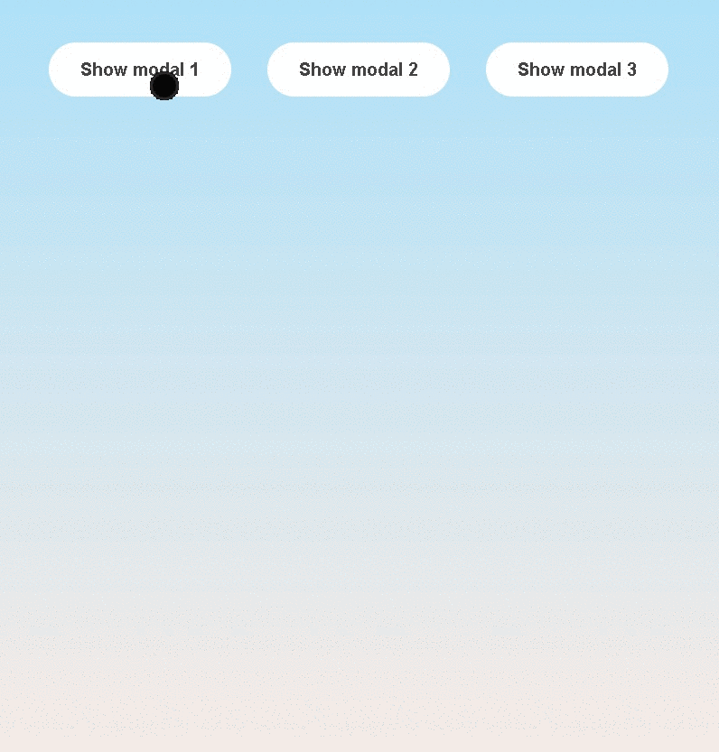

<h1 align="center"> Modal Window </h1>

 This is a repo made to store a modal window solution. Is a pop up window that you can close either with the esc button, the x or by clicking on the background 

 This project is to practice JavaScript manipulation of the DOM, CSS styles, Event Listeners, Refactoring the code, Adding and removing classes etc

 

Click the demo preview and it will take you to the modal window site!
 
 
 

</>
